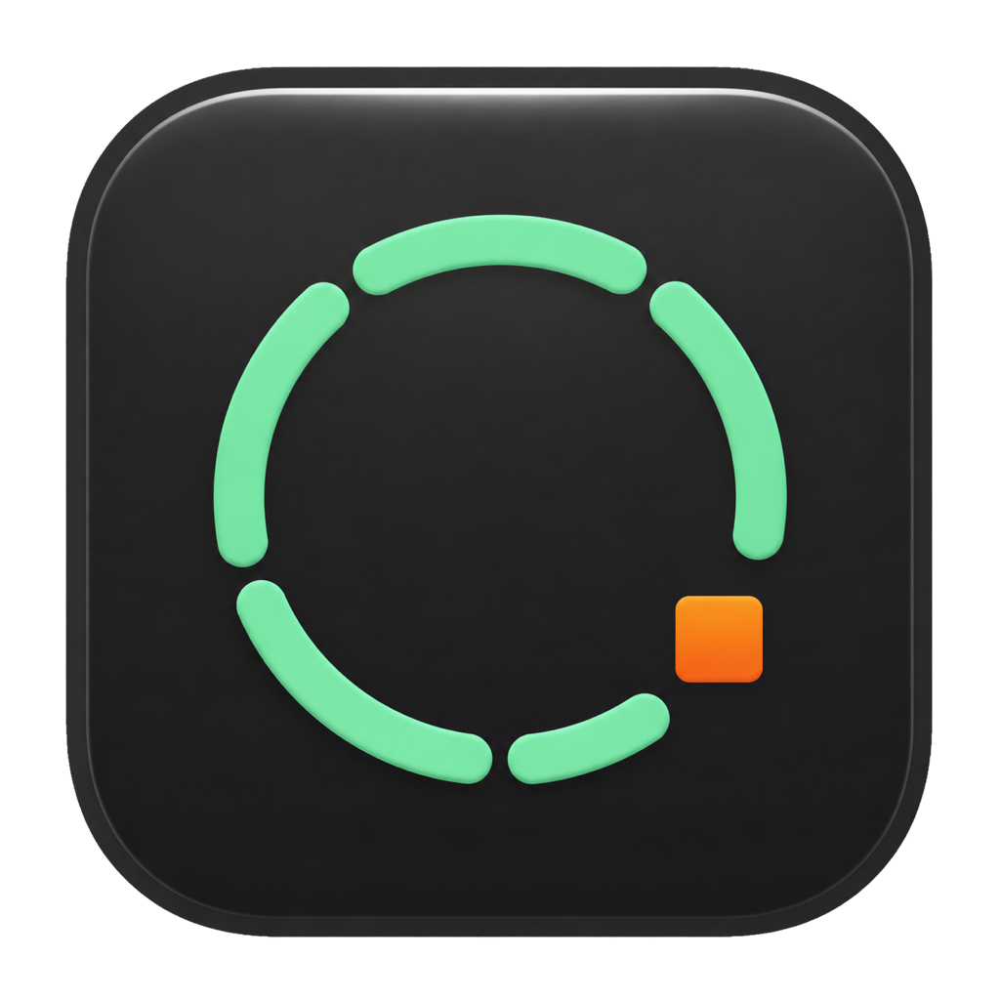
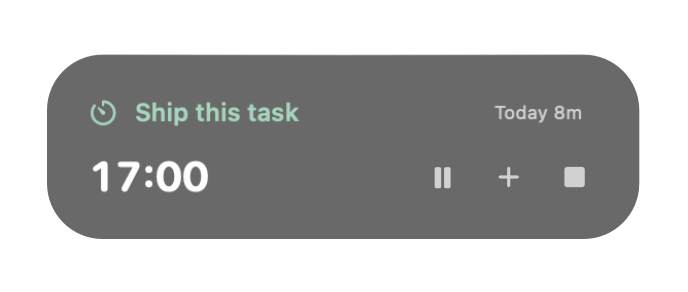
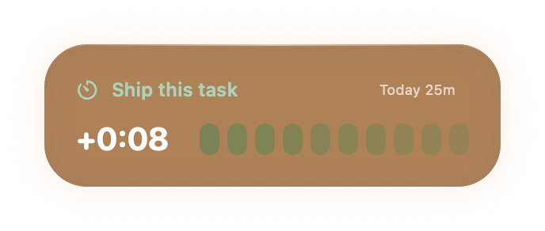

# Pomo

<p align="center">
  
</p>

時間を区切り、だらだら続く作業に「終わり」をつくるmacOS用フォーカスタイマーです。

<p align="center">
  
</p>

Pomoは、時間切れになった瞬間に作業を強制終了するアプリではありません。目標時刻を置き、そこへ向かって集中し、時間を超えたら超過を見ながら「ここで終える」と自分で決めるためのアプリです。

## こんな人へ

- 時間制限を決めず、ひとつの作業をずっと続けてしまう
- タスクの所要時間をうまく見積もれない
- 着手はするのに、完了するタスクが増えない
- ポモドーロを使いたいが、開始までの設定操作が面倒で続かなかった

目標は、タイマーを使い続けることではありません。見積もりの感覚を取り戻し、終わらない作業を減らし、完了を増やしていくことです。

## Pomoの考え方

1. 次に完了させたいタスクと、必要だと思う集中時間を決める
2. 目標時刻まで集中する
3. 足りなければ、タイマーを止めずに超過時間を確認する
4. 自分で終了を決め、実際にかかった時間を残す
5. 繰り返しから、自分の見積もりの傾向を知る

超過は失敗ではなく、見積もりを改善するための手がかりです。

## UI

| 開始前 | 予定時間を超えたとき |
| --- | --- |
| タイマーにカーソルを置くと、タスク名と集中時間をその場で編集できます。Enterですぐ開始します。 | 時間切れでも作業は続き、超過時間を表示します。終了するタイミングは自分で決めます。 |
|  |  |

集中中にカーソルを置くと、次の操作だけが現れます。

- 一時停止・再開
- 5分追加
- 現在の時間を記録して終了

作業を終了すると休憩が自動で始まります。休憩後は次の作業を自動開始せず、新しいタスクを決める状態へ戻ります。

## 使い方

1. Pomoへカーソルを置く
2. タスク名と集中時間を入力する
3. Enterまたは再生ボタンで開始する
4. 必要なら一時停止・5分追加を使う
5. 作業を終えるときに停止ボタンを押す

休憩時間、ウィンドウサイズ、ゲージ色、最前面表示などは右クリックメニューから変更できます。

## データとプライバシー

Pomoはネットワーク通信やアクセス解析を行いません。設定はmacOSの`UserDefaults`へ、セッション履歴はローカルの`~/Library/Application Support/Pomo/sessions.jsonl`へ保存します。

セッション履歴にはタスク名、開始・終了時刻、実績秒数、終了理由などが含まれます。個人的なタスク名が入るため、このファイルを公開リポジトリへ追加しないでください。

現時点の履歴には実績時間が残りますが、そのセッション開始時の見積もり時間は記録していません。見積もりと実績の継続的な比較や、AIと一緒に傾向を振り返る機能は今後の構想です。

## 起動する

現在は署名済みアプリを配布していないため、ソースから起動します。macOS 13以降とXcode Command Line Toolsが必要です。

```bash
git clone https://github.com/pinecandy/Pomo.git
cd Pomo
swift run Pomo
```

開発時の検証は次のコマンドでまとめて実行できます。

```bash
./scripts/check.sh
```

## ライセンス

現在はライセンス未設定です。コードの利用・改変・再配布条件は、ライセンスを追加するまで明示的に許諾していません。
